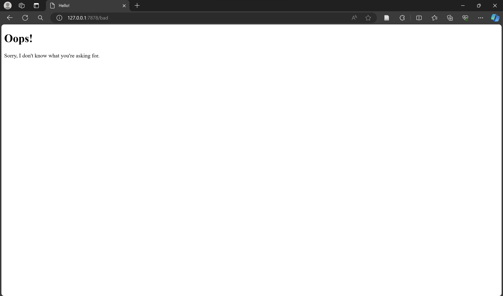

# Reflection
## Module 6

### Reflection Commit 1
1. Mengimport std::io::prelude and std::io::BufReader untuk memungkinkan kita membaca dan menulis ke stream
2. Membuat BufReader instance yang akan meng-wrap mutable reference ke instance TcpStream. BufReader akan menambahkan buffer dengan mengelola pemanggilan ke std::io::Read
```
let buf_reader = BufReader::new(&mut stream);
```
3. Membuat variable http_request yang akan mengumpulkan baris dari request yang dikirimkan ke server. Baris tersebut disimpan dalam bentuk vector. Kita menggunakan method lines() untuk memecah stream data setiap kali menemui byte newline. Untuk mendapatkan tiap string, kita map dan unwrap tiap string dengan map(|result| result.unwrap()). Jika result berupa  error, maka program akan berhenti. Selanjutnya, take_while(|line| !line.is_empty) digunakan untuk mengambil tiap baris hingga ditemukan baris berupa string kosong. Dan terakhir collect() digunakan untuk mengumpulkan semua baris kedalam vector.
```
    let http_request: Vec<_> = buf_reader 
    .lines() 
    .map(|result| result.unwrap())
    .take_while(|line| !line.is_empty()) 
    .collect();
```

### Reflection Commit 2

1. Membuat file html baru "hello.html" yang akan ditampilkan sebagai berikut
```
<!DOCTYPE html>
<html lang="en">
 <head>
 <meta charset="utf-8"> <title>Hello!</title>
 </head> <body> <h1>Hello!</h1> <p>Hi from Rust, running from Hanau’s machine.</p>
 </body>
</html>
```
2. Menambahkan fs yang memungkinkan untuk membaca suatu file
3. Pada handle_connection, kita membaca file "hello.html" dengan fs dalam bentuk string lalu mengambil panjang dari isi file "hello.html" tersebut
```
let contents = fs::read_to_string("hello.html").unwrap(); 
let length = contents.len();
```
4. Menggunakan format! untuk menambahkan kontent dari file "hello.html" sebagai body dari response
```
let response = format!("{status_line}\r\nContent-Length: {length}\r\n\r\n{contents}");
stream.write_all(response.as_bytes()).unwrap();
```

### Reflection Commit 3

1. Mengambil request line dari suatu http request. Request line tersebut berisi request method dan path yang digunakan. Berikut codenya
```
let request_line = buf_reader.lines().next().unwrap().unwrap();
```
2. Set status line dan file html sesuai dengan request line. Jika request_line tidak sesuai, maka akan menampilkan page 404 error. Berikut codenya
```
let (status_line, filename) = if request_line == "GET / HTTP/1.1" {
    ("HTTP/1.1 200 OK", "hello.html")
} else {
    ("HTTP/1.1 404 NOT FOUND", "404.html")
};
```
3. Berikut adalah code 404.html
```
<!DOCTYPE html>
<html lang="en">
  <head>
    <meta charset="utf-8">
    <title>Hello!</title>
  </head>
  <body>
    <h1>Oops!</h1>
    <p>Sorry, I don't know what you're asking for.</p>
  </body>
</html>
```
Mengapa refactor diperlukan:
Pada code sebelum refactor, ada beberapa repetisi atau code yang duplikat. Bagian code yang duplikat adalah bagian saat kita membaca dari suatu file html lalu memasukkannya sebagai body dari response. Kita dapat mengeluarkan bagian code tersebut setelah block if-else, dimana if-else hanya berisi peng-assign an dari status line dan file html yang akan dijadikan body response.

### Reflection Commit 4
1. Menambahkan 1 kasus baru yaitu ketika path nya berupa /sleep, dimana path tersebut menunggu selama 5 detik sebelum dapat dijalankan
```
let (status_line, filename) = match &request_line[..] {
    "GET / HTTP/1.1" => ("HTTP/1.1 200 OK", "hello.html"),
    "GET /sleep HTTP/1.1" => {
        thread::sleep(Duration::from_secs(5));
        ("HTTP/1.1 200 OK", "hello.html")
    }
    _ => ("HTTP/1.1 404 NOT FOUND", "404.html"),
};
```

Mengapa browser membutuhkan waktu yang lama saat ingin membuka beberapa 127.0.0.1 dengan 127.0.0.1\sleep salah satunya?
Alasan mengapa browser membutuhkan waktu lama adalah karena setiap request di tangani oleh server secara bergantian. Request ke 127.0.0.1\sleep akan menyebabkan server melakukan sleep selama 5 detik. Hal ini menyebabkan ketika kita ingin membuka url 127.0.0.1 lain, maka server menunggu hingga request 127.0.0.1\sleep selesai di tangani, sehingga membutuhkan waktu yang cukup lama untuk membuka url lain ke server tersebut.

### Reflection 5
1. Mengubah code pada main sehingga menggunakan ThreadPool untuk menghandle beberapa request (Dalam code saya hingga 5 request)
```
fn main() {
    let listener = TcpListener::bind("127.0.0.1:7878").unwrap();
    let pool = ThreadPool::new(5);

    for stream in listener.incoming() {
        let stream = stream.unwrap();

        pool.execute(|| {
            handle_connection(stream);
        });
    }
}
```
2. Membuat file lib.rs yang berisi implementasi dari ThreadPool
```
use std::{
    sync::{mpsc, Arc, Mutex},
    thread,
};

pub struct ThreadPool {
    workers: Vec<Worker>,
    sender: mpsc::Sender<Job>,
}

type Job = Box<dyn FnOnce() + Send + 'static>;

impl ThreadPool {
    pub fn new(size: usize) -> ThreadPool {
        assert!(size > 0);

        let (sender, receiver) = mpsc::channel();

        let receiver = Arc::new(Mutex::new(receiver));

        let mut workers = Vec::with_capacity(size);

        for id in 0..size {
            workers.push(Worker::new(id, Arc::clone(&receiver)));
        }

        ThreadPool { workers, sender }
    }

    pub fn execute<F>(&self, f: F)
    where
        F: FnOnce() + Send + 'static,
    {
        let job = Box::new(f);

        self.sender.send(job).unwrap();
    }
}

struct Worker {
    id: usize,
    thread: thread::JoinHandle<()>,
}

impl Worker {
    fn new(id: usize, receiver: Arc<Mutex<mpsc::Receiver<Job>>>) -> Worker {
        let thread = thread::spawn(move || loop {
            let job = receiver.lock().unwrap().recv().unwrap();

            println!("Worker {id} got a job; executing.");

            job();
        });

        Worker { id, thread }
    }
}
```

Penjelasan konsep ThreadPool yang diimplementasi
Implementasi dari ThreadPool pada proyek ini menggunakan 3 struct yaitu ThreadPool, Workers, dan Jobs. Saat ThreadPool di inisiasi dengan new, maka akan terbuat beberapa instance worker dan sebuah pasangan sender dan receiver dimana receiver telah dilindungi dengan mutual exclusion atau mutex. Worker merupakan suatu objek yang menyimpan suatu thread yang telah di spawn atau dibuat. Sementara itu, jobs merupakan pekerjaan yang akan dieksekusi atau dikerjakan oleh worker. method execute pada ThreadPool akan mengirim suatu job kepada thread yang disimpan oleh worker, yang nantinya akan dieksekusi oleh worker, dimana method ini menggunakan konsep message passing untuk mengirim job ke worker tersebut